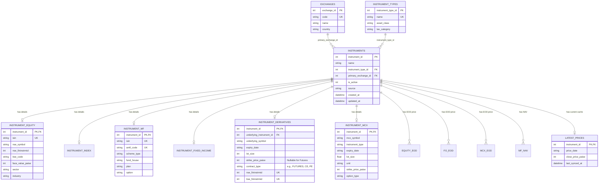

# AISPL Database Schema (Normalized Design)

This document outlines the unified, normalized database design adopted for both the backend server and desktop application. 

It relies on an integer-based `instrument_id` as the primary universal identifier, fully normalizes lookup tables (`exchanges`, `instrument_types`), and standardizes financial fields (e.g., `strike_price_paise`).

## Entity-Relationship Diagram

