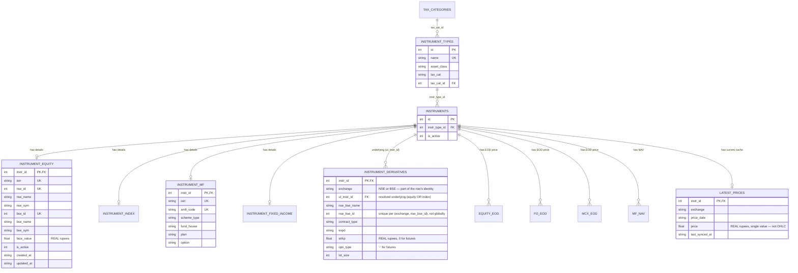

# AISPL Database Schema

This document describes `portfolio_server.db`'s schema as it actually is today.

**Equity, index, and derivatives identity/detail tables now come from the shared
[`arthdesk-instruments`](https://github.com/d-machine/arthdesk-instruments) package** (also used by
the desktop client), not from this repo's own DDL — so the server and client can't drift apart on
them the way `bse_symbol`/`MF`/`instrument_type` previously did. See
`app/tables.py` (imports) and `app/db_init.py` (`init_schema()` creates/seeds them).

**MF, MCX, fixed income, and all price tables (`latest_prices`, `equity_eod`, `fo_eod`, `mcx_eod`,
`mf_nav`) are also sourced from the same package now** (schema only). Equity/derivatives prices are
fully wired up: `arthdesk_instruments.dao.prices` + the bhavcopy sync jobs write `latest_prices`/
`equity_eod`/`fo_eod` for real, and `app/routers/prices.py` reads through the same DAO. MF/MCX have
no DAO layer yet, so `mf_nav`/`mcx_eod` and the MF branch of `/instruments/search` remain
known-broken until that lands.

## Key differences from the old (pre-Phase-4) schema

- **Hub `instruments` table is minimal**: `id`, `instr_type_id`, `is_active` only — no `name`,
  `isin`, `created_at`/`updated_at`. Every descriptive field lives on the per-type detail table
  instead (`instrument_equity.nse_name`/`bse_name`, etc.).
- **All money is `REAL` rupees to 6dp, never `_paise` integers.** `instrument_equity.face_value`,
  `instrument_derivatives.strkp`, EOD price columns — all real-valued rupees.
- **Derivatives are exchange-scoped, not exchange-agnostic.** An NSE F&O contract and a BSE F&O
  contract are separate rows (`exchange` + `nse_bse_id`), even if they'd describe "the same"
  underlying/expiry/strike — they're genuinely different, independently-traded instruments. The old
  schema modeled one row with both `nse_fininstrmid`/`bse_fininstrmid` columns, which is why this
  doc used to show them that way.
- **No `exchanges`-table foreign keys from instrument tables.** `instrument_index` dropped its
  `exchange` column entirely (small, curated, hand-seeded table — symbols don't collide across
  exchanges); EOD tables use a plain `exchange` text column, not an FK (each row is already scoped
  to one exchange via its own primary key).

## Entity-Relationship Diagram


```mermaid
erDiagram
    %% ─── Reference tables (arthdesk_instruments) ───
    INSTRUMENT_TYPES ||--o{ INSTRUMENTS : "instr_type_id"
    TAX_CATEGORIES ||--o{ INSTRUMENT_TYPES : "tax_cat_id"

    %% ─── Instrument hub (arthdesk_instruments) ───
    INSTRUMENTS ||--o| INSTRUMENT_EQUITY : "has details"
    INSTRUMENTS ||--o| INSTRUMENT_INDEX : "has details"
    INSTRUMENTS ||--o| INSTRUMENT_MF : "has details"
    INSTRUMENTS ||--o| INSTRUMENT_FIXED_INCOME : "has details"
    INSTRUMENTS ||--o{ INSTRUMENT_DERIVATIVES : "underlying (ul_instr_id)"

    %% ─── Prices (arthdesk_instruments) ───
    INSTRUMENTS ||--o{ EQUITY_EOD : "has EOD price"
    INSTRUMENTS ||--o{ FO_EOD : "has EOD price"
    INSTRUMENTS ||--o{ MCX_EOD : "has EOD price"
    INSTRUMENTS ||--o{ MF_NAV : "has NAV"
    INSTRUMENTS ||--o| LATEST_PRICES : "has current cache"

    %% ─── Table Definitions ───

    INSTRUMENT_TYPES {
        int id PK
        string name UK
        string asset_class
        string tax_cat
        int tax_cat_id FK
    }

    INSTRUMENTS {
        int id PK
        int instr_type_id FK
        int is_active
    }

    INSTRUMENT_EQUITY {
        int instr_id PK, FK
        string isin UK
        int nse_id UK
        string nse_name
        string nse_sym
        int bse_id UK
        string bse_name
        string bse_sym
        float face_value "REAL rupees"
        int is_active
        string created_at
        string updated_at
    }

    INSTRUMENT_MF {
        int instr_id PK, FK
        string isin UK
        string amfi_code UK
        string scheme_type
        string fund_house
        string plan
        string option
    }

    INSTRUMENT_DERIVATIVES {
        int instr_id PK, FK
        string exchange "NSE or BSE — part of the row's identity"
        int ul_instr_id FK "resolved underlying (equity OR index)"
        string nse_bse_name
        int nse_bse_id "unique per (exchange, nse_bse_id), not globally"
        string contract_type
        string expd
        float strkp "REAL rupees, 0 for futures"
        string opn_type "'-' for futures"
        int lot_size
    }

    LATEST_PRICES {
        int instr_id PK, FK
        string exchange
        string price_date
        float price "REAL rupees, single value — not OHLC"
        string last_synced_at
    }
```

## Still on the server's own (hand-written, pre-Phase-4) schema for operational data

Not part of `arthdesk-instruments` — unrelated to instrument identity, untouched:

- `exchanges` (code/name/country — reference data for sources other than the instrument tables now)
- `bhavcopy_files` (per-file sync tracking: status, rows_synced, error)
- `trading_calendar` (market holidays)

## Database access layering

**No code queries the DB directly — everything goes through `arthdesk_db.Database`, which is
then passed into `arthdesk_instruments.dao` for instrument queries.** This applies uniformly to
FastAPI routers *and* background cron jobs, not just request-scoped code.

```
Router / cron job
      │
      ▼
arthdesk_db.Database   (app/database.py — get_db() for requests, db_session() for cron jobs)
      │
      ▼
arthdesk_instruments.dao.*   (duck-types on Database.execute — same calls work with a raw
                               Connection too, which is how this stayed a drop-in change)
```

- **Routers** get a `Database` via FastAPI's `Depends(get_db)` — the existing, request-scoped
  pattern. `app/routers/bhavcopy.py`'s `sync_inbox` is the latest example (was a raw
  `engine.connect()` call despite already having a request lifecycle to hang a dependency off).
- **Cron jobs have no request lifecycle** — they run as detached `threading.Thread`s kicked off
  from `/admin/bhavcopy/parse`, so `Depends()` isn't available. They use `app/database.py`'s
  `db_session()` context manager instead: constructs a `SessionLocal()`, wraps it in `Database`,
  and closes the *session* directly in `finally` (`Database` itself has no `close()` — this
  matches `arthdesk-db`'s own test-suite convention of the caller holding the session reference).
- **One `Database`/one transaction per file**, not per step. `app/cron/bhavcopy/sync/{nse_eq,
  bse_eq,nse_fo,bse_fo}.py`'s `run()` opens one `db_session()` per pending file, and everything
  that file touches — resolving/creating/updating instruments, the `equity_eod`/`fo_eod` insert,
  and the `bhavcopy_files` status update — happens on that one `Database` with a single
  `db.commit()` at the end. This is a correctness improvement over the pre-fix version (today's
  schema cutover, Phase 4), which opened a separate connection/transaction per step — a crash
  mid-file could previously leave price rows written but the file still marked `DOWNLOADED`, or
  vice versa; now it's all-or-nothing per file.
- `app/cron/bhavcopy/sync/base.py` holds the adapters each sync job calls (`bulk_resolve_equity`,
  `bulk_create_fo`, `get_or_create_index`, etc.) — every in-scope one takes `db` as its first
  argument and does no internal connection management or commit; the caller (`run()`) commits
  once. The still-deferred MF/MCX/prices helpers in the same file (`bulk_create_mf`,
  `bulk_resolve_mcx`, `batch_upsert_latest_prices`, `_get_type_id`) are the one exception —
  they still open their own `engine.connect()`/`engine.begin()`, since they serve paths that are
  already broken pending their own DAO migration (see "Still TODO" below); fixing their access
  pattern without fixing the underlying schema mismatch would be wasted effort.
- `app/db_init.py`'s own `engine` usage is legitimate and out of scope: schema creation/bootstrap
  (DDL) is a fundamentally different operation from querying, and `arthdesk_instruments.
  init_schema()` itself takes a raw `engine` for the same reason — it manages its own
  `engine.begin()` internally, so it can't be handed a `Database`/`Connection` that's already
  inside another transaction.

### Still TODO (known, deliberately deferred)

- MF/MCX querying in `base.py` (`bulk_create_mf`, `bulk_resolve_mcx`, `get_or_create_mf`,
  `bulk_create_mcx`, `_get_type_id`) and the MF branch of `/instruments/search` — no shared DAO
  layer exists yet for these, so they're still on ad-hoc raw SQL against a schema that's already
  drifted (see the warning at the top of this doc). They get the `Database`-everywhere treatment in
  the same round their DAO migration happens, not before. (Equity/derivatives prices are done —
  see `arthdesk_instruments.dao.prices` and `base.py`'s `upsert_latest_prices`.)
- `app/cron/bhavcopy/*.py` (the download/register side, not `sync/`) — a different lifecycle
  stage of `bhavcopy_files` (download status, not sync status) and a separate concern from
  instrument querying. Flagged, not yet migrated.
