# Server API design — one diagram per route

Every route currently registered in `app/main.py`, grouped by router file. Each diagram shows the
same shape: client → route → dependency chain (auth/subscription/admin checks) → handler logic →
which database(s) it touches → response. Two physically separate SQLite databases exist —
`portfolio_server.db` (`db`, market/instrument data) and `auth.db` (`auth_db`, users/subscriptions/
tickets/parsers) — every diagram is explicit about which one(s) a route uses.

Diagrams are Mermaid flowcharts — render natively on GitHub, or via any Mermaid-compatible viewer.

---

## `/auth` — `app/routers/auth.py`

### `GET /auth/admin/check`
Verifies the caller's HTTP Basic credentials match `ADMIN_USER`/`ADMIN_PASS` — used by ops tooling
to check admin creds work without side effects.
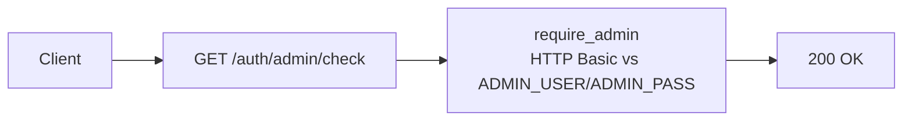

### `POST /auth/register`
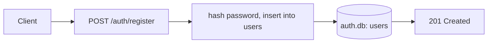

### `POST /auth/login`
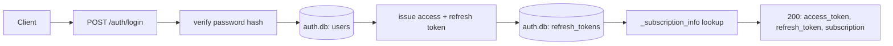

### `POST /auth/refresh`
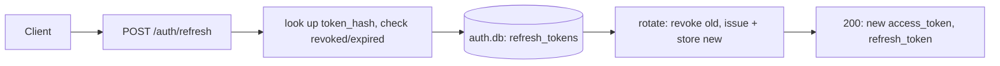

### `POST /auth/logout`
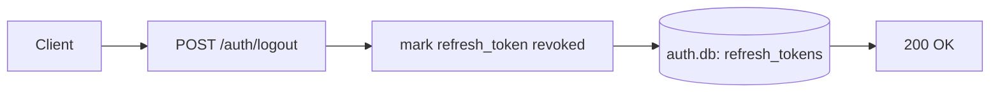

### `GET /auth/me`
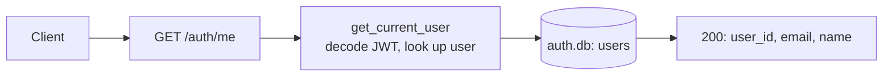

### `POST /auth/forgot-password`
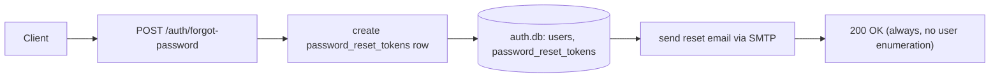

### `GET /auth/reset-password` (HTML form)
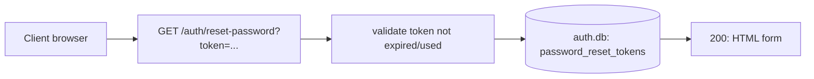

### `POST /auth/reset-password` (HTML form submit)
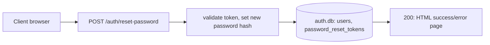

---

## `/persons` — `app/routers/persons.py`

### `GET /persons`
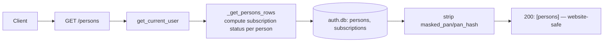

### `GET /persons/secure`
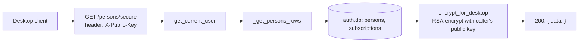

### `POST /persons`
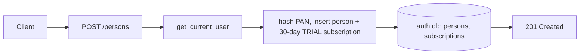

### `DELETE /persons/{person_id}`
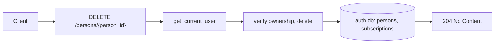

---

## `/subscriptions` — `app/routers/subscriptions.py`

### `GET /subscriptions/status`
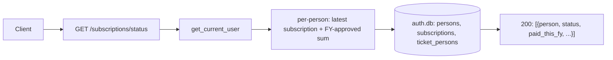

### `GET /subscriptions/history`
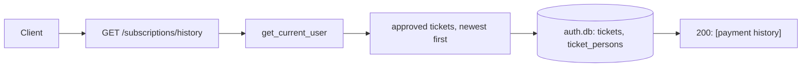

### `GET /subscriptions/admin/users`
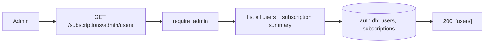

### `GET /subscriptions/admin/users/{user_id}`
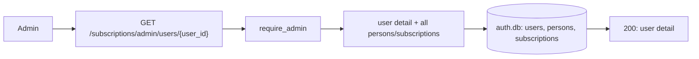

### `GET /subscriptions/admin/persons`
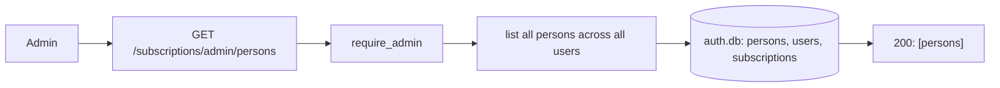

### `POST /subscriptions/admin/persons/{person_id}/block`
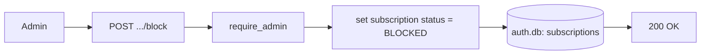

### `POST /subscriptions/admin/persons/{person_id}/unblock`
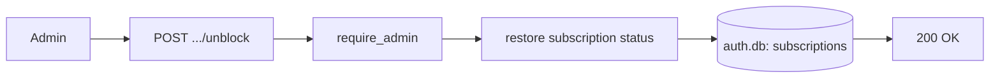

---

## `/tickets` — `app/routers/tickets.py`

### `POST /tickets/submit`
User submits a payment screenshot claiming payment for one or more persons.
```mermaid
flowchart LR
    C[Client] --> R["POST /tickets/submit\n(multipart: screenshot + person amounts)"]
    R --> D1[get_current_user]
    D1 --> Up[save screenshot to disk]
    Up --> H[insert ticket + ticket_persons rows]
    H --> AuthDB[(auth.db: tickets, ticket_persons)]
    AuthDB --> Resp["201: ticket_id"]
```

### `GET /tickets/my`
```mermaid
flowchart LR
    C[Client] --> R["GET /tickets/my"]
    R --> D1[get_current_user]
    D1 --> H[list caller's tickets + per-person claims]
    H --> AuthDB[(auth.db: tickets, ticket_persons)]
    AuthDB --> Resp["200: [tickets]"]
```

### `GET /tickets/admin`
```mermaid
flowchart LR
    C[Admin] --> R["GET /tickets/admin"]
    R --> D1[require_admin]
    D1 --> H[list all tickets, filterable by status]
    H --> AuthDB[(auth.db: tickets, ticket_persons)]
    AuthDB --> Resp["200: [tickets]"]
```

### `GET /tickets/admin/{ticket_id}`
```mermaid
flowchart LR
    C[Admin] --> R["GET /tickets/admin/{ticket_id}"]
    R --> D1[require_admin]
    D1 --> H[_ticket_detail: full ticket + persons + screenshot URL]
    H --> AuthDB[(auth.db: tickets, ticket_persons)]
    AuthDB --> Resp["200: ticket detail"]
```

### `PATCH /tickets/admin/{ticket_id}/persons/{tp_id}`
Admin adjusts the approved amount for one person's claim within a ticket, before approving.
```mermaid
flowchart LR
    C[Admin] --> R["PATCH .../persons/{tp_id}"]
    R --> D1[require_admin]
    D1 --> H[update ticket_persons.approved_amount/notes]
    H --> AuthDB[(auth.db: ticket_persons)]
    AuthDB --> Resp["200 OK"]
```

### `POST /tickets/admin/{ticket_id}/approve`
```mermaid
flowchart LR
    C[Admin] --> R["POST .../approve"]
    R --> D1[require_admin]
    D1 --> H[create/extend subscription per approved person]
    H --> AuthDB1[(auth.db: subscriptions)]
    AuthDB1 --> Mark[mark ticket APPROVED]
    Mark --> AuthDB2[(auth.db: tickets)]
    AuthDB2 --> Email[email user]
    Email --> Resp["200 OK"]
```

### `POST /tickets/admin/{ticket_id}/decline`
```mermaid
flowchart LR
    C[Admin] --> R["POST .../decline"]
    R --> D1[require_admin]
    D1 --> H[mark ticket DECLINED + reason]
    H --> AuthDB[(auth.db: tickets)]
    AuthDB --> Email[email user]
    Email --> Resp["200 OK"]
```

### `POST /tickets/admin/create`
Admin manually creates and immediately records a ticket on a user's behalf (e.g. offline payment).
```mermaid
flowchart LR
    C[Admin] --> R["POST /tickets/admin/create"]
    R --> D1[require_admin]
    D1 --> H[insert ticket + ticket_persons, no screenshot]
    H --> AuthDB[(auth.db: tickets, ticket_persons)]
    AuthDB --> Resp["201: ticket_id"]
```

---

## `/instruments` — `app/routers/instruments.py`

### `GET /instruments/types`
```mermaid
flowchart LR
    C[Client] --> R["GET /instruments/types"]
    R --> H["select(instrument_types) — SQLAlchemy Core"]
    H --> DB[(portfolio_server.db: instrument_types)]
    DB --> Resp["200: [instrument_types]"]
```

### `GET /instruments/asset-classes`
```mermaid
flowchart LR
    C[Client] --> R["GET /instruments/asset-classes"]
    R --> H["select(asset_classes) — SQLAlchemy Core"]
    H --> DB[(portfolio_server.db: asset_classes)]
    DB --> Resp["200: [asset_classes] — synced to desktop's AssetClass enum"]
```

### `GET /instruments/updates`
Delta sync — instrument metadata changed since a timestamp, for desktop's local cache refresh.
```mermaid
flowchart LR
    C[Desktop client] --> R["GET /instruments/updates?since=..."]
    R --> D1[require_active_subscription]
    D1 --> H[join instruments + all extension tables\nfilter by updated_at]
    H --> DB[(portfolio_server.db: instruments, instrument_equity/index/mf/mcx)]
    DB --> Resp["200: { updates, synced_at }"]
```

### `POST /instruments/resolve`
The fixed-match endpoint — per-asset-class resolution for pending instruments.
```mermaid
flowchart LR
    C[Desktop client] --> R["POST /instruments/resolve\nbody: [PendingRef]"]
    R --> D1[require_active_subscription]
    D1 --> Disp{dispatch by\ninstrument_type}
    Disp -->|EQUITY| RE[_resolve_equity]
    Disp -->|INDEX| RI[_resolve_index]
    Disp -->|MF variants| RM[_resolve_mf]
    Disp -->|FUTURES/OPTIONS| RF[_resolve_fo]
    Disp -->|COMMODITY_*| RC[_resolve_mcx]
    RE --> DB[(portfolio_server.db)]
    RI --> DB
    RM --> DB
    RF --> DB
    RC --> DB
    DB --> Resp["200: { resolved: [...] } — unresolved omitted"]
```

### `GET /instruments/search`
Free-text search — the candidate-fetching endpoint used by the desktop dropdown.
```mermaid
flowchart LR
    C[Desktop client] --> R["GET /instruments/search?q=...&asset_class=..."]
    R --> D1[require_active_subscription]
    D1 --> Disp{asset_class branch}
    Disp -->|EQUITY| SE[LIKE match on\nisin/nse_symbol/bse_code]
    Disp -->|MF| SM[LIKE/exact on\namfi_code/isin]
    SE --> DB[(portfolio_server.db: instruments + extension tables)]
    SM --> DB
    DB --> Resp["200: { results: [...] }"]
```

### `POST /instruments/equity`
Create a new equity instrument in the server's master catalog.
```mermaid
flowchart LR
    C[Client] --> R["POST /instruments/equity"]
    R --> H[insert instruments + instrument_equity]
    H --> DB[(portfolio_server.db)]
    DB --> Resp["200/201: created instrument"]
    style D1 fill:none,stroke-dasharray: 5 5
    D1["⚠ no auth dependency today"] -.-> R
```

### `GET /instruments/{isin}`
```mermaid
flowchart LR
    C[Client] --> R["GET /instruments/{isin}"]
    R --> H[lookup by ISIN]
    H --> DB[(portfolio_server.db: instruments, instrument_equity)]
    DB --> Resp["200: instrument | 404"]
    style D1 fill:none,stroke-dasharray: 5 5
    D1["⚠ no auth dependency today"] -.-> R
```

---

## `/prices` — `app/routers/prices.py`

### `GET /prices/latest`
```mermaid
flowchart LR
    C[Client] --> R["GET /prices/latest?instrument_ids=..."]
    R --> D1[require_active_subscription]
    D1 --> H[read in-memory price cache\nno DB hit after first request/day]
    H --> Cache[(in-process cache)]
    Cache --> Resp["200: { date, prices } (cache_miss flag if cold)"]
```

### `GET /prices/sync`
Incremental EOD price sync — preferred `instrument_ids` path or legacy `isins`/`since_date` path.
```mermaid
flowchart LR
    C[Client] --> R["GET /prices/sync?instrument_ids=...&since_datetime=..."]
    R --> D1[require_active_subscription]
    D1 --> Disp{instrument_ids given?}
    Disp -->|yes| P1[query latest_prices by instrument_id]
    Disp -->|no, isins given| P2[legacy: join instrument_equity]
    Disp -->|no, since_date given| P3[legacy: historical equity_eod]
    P1 --> DB[(portfolio_server.db: latest_prices, equity_eod)]
    P2 --> DB
    P3 --> DB
    DB --> Resp["200: { prices, synced_at }"]
```

### `GET /prices/trading-calendar`
```mermaid
flowchart LR
    C[Client] --> R["GET /prices/trading-calendar?year=..."]
    R --> H[query holidays for year]
    H --> DB[(portfolio_server.db: trading_calendar)]
    DB --> Resp["200: { holidays }"]
    style D1 fill:none,stroke-dasharray: 5 5
    D1["⚠ no auth dependency — intentionally public"] -.-> R
```

---

## `/admin/bhavcopy` — `app/routers/bhavcopy.py`

None of these three routes declare any auth dependency — they're the "Manual admin triggers" from
the README, presumably relied on to be network/infra-protected rather than app-gated. All three run
as FastAPI `BackgroundTasks` (fire, return a job id immediately, work continues after response).

### `GET /admin/bhavcopy/download`
```mermaid
flowchart LR
    C[Admin/cron] --> R["GET /admin/bhavcopy/download"]
    R --> H[enqueue background job]
    H --> BG[[_run_download_job:\nfetch NSE/BSE/MCX bhavcopy files]]
    BG --> FS[(local files under inbox/)]
    BG --> DB[(portfolio_server.db: bhavcopy_files)]
    R --> Resp["200: { job_id } — immediate"]
```

### `POST /admin/bhavcopy/sync-inbox`
Parses previously-downloaded (or manually dropped) bhavcopy files from `inbox/` into the DB.
```mermaid
flowchart LR
    C[Admin/cron] --> R["POST /admin/bhavcopy/sync-inbox"]
    R --> H[match inbox files, parse, upsert EOD rows]
    H --> FS[(inbox/ files)]
    H --> DB[(portfolio_server.db: equity_eod/fo_eod/mcx_eod/mf_nav, bhavcopy_files)]
    DB --> Resp["200: { synced counts }"]
```

### `POST /admin/bhavcopy/parse`
```mermaid
flowchart LR
    C[Admin/cron] --> R["POST /admin/bhavcopy/parse"]
    R --> H[enqueue background parse job]
    H --> BG[[_run_parse_job]]
    BG --> DB[(portfolio_server.db)]
    R --> Resp["200: { job_id } — immediate"]
```

---

## `/parsers` — `app/routers/parsers.py`

*(Currently uncommitted, pre-existing work — the OTA broker-importer sync feature.)*

### `GET /parsers/manifest`
```mermaid
flowchart LR
    C[Desktop client] --> R["GET /parsers/manifest"]
    R --> D1[get_current_user]
    D1 --> H[list active parsers: source, version, checksum]
    H --> AuthDB[(auth.db: parsers)]
    AuthDB --> Resp["200: { parsers: [...] }"]
```

### `GET /parsers/download/{source}`
```mermaid
flowchart LR
    C[Desktop client] --> R["GET /parsers/download/{source}"]
    R --> D1[get_current_user]
    D1 --> H[look up file_name for source]
    H --> AuthDB[(auth.db: parsers)]
    AuthDB --> FS[read file from PARSERS_PATH]
    FS --> Resp["200: file stream (.py) | 404"]
```

### `POST /parsers/register`
Admin drops a `.py` file on the server, then calls this to register its version/checksum.
```mermaid
flowchart LR
    C[Admin] --> R["POST /parsers/register"]
    R --> D1[require_admin]
    D1 --> H[read file, sha256, upsert]
    H --> FS[read from PARSERS_PATH]
    H --> AuthDB[(auth.db: parsers)]
    AuthDB --> Resp["200: { source, version, checksum_sha256 }"]
```

### `DELETE /parsers/{source}`
```mermaid
flowchart LR
    C[Admin] --> R["DELETE /parsers/{source}"]
    R --> D1[require_admin]
    D1 --> H[set is_active = 0]
    H --> AuthDB[(auth.db: parsers)]
    AuthDB --> Resp["200 OK | 404"]
```

---

## Observations surfaced while building this

- **Two endpoints in `/instruments` have no auth dependency at all**: `POST /instruments/equity`
  (creates instruments) and `GET /instruments/{isin}`. Marked with a dashed "⚠" node above rather
  than silently omitted — worth confirming whether that's intentional (public read/write) or an
  oversight, since every comparable instrument endpoint requires `require_active_subscription`.
- **`/admin/bhavcopy`'s three routes have no auth dependency either** — consistent with each other,
  but means they rely entirely on network-level protection (not exposed publicly, or behind a
  separate gateway) rather than anything FastAPI enforces.
- **`/prices/trading-calendar` is intentionally public** (market holidays aren't sensitive) — this
  one looks deliberate, unlike the two above.

---

# Appendix — full database schemas

Source of truth: `app/db_init.py` (`portfolio_server.db`) and `app/auth_db_init.py` (`auth.db`).
Both are plain SQLite DDL, applied idempotently (`CREATE TABLE IF NOT EXISTS`) on every startup —
no versioned migrations on the server side (see the note on this in the main plan doc). All money
columns are **paise** (integer), not rupees — the opposite convention from the desktop client.

## `portfolio_server.db`

### Reference

**`exchanges`**
| column  | type | constraints |
|---|---|---|
| code    | TEXT | PRIMARY KEY |
| name    | TEXT | NOT NULL |
| country | TEXT | NOT NULL DEFAULT `'IN'` |

**`asset_classes`** — canonical asset-class codes, normalized out of `instrument_types` so the
value set is enforced by a real FK instead of a bare, unconstrained string. Codes match
`arthdesk-py`'s `backend/enums.py::AssetClass` exactly — synced to desktop via
`GET /instruments/asset-classes` rather than each side hardcoding its own copy.
| column | type | constraints |
|---|---|---|
| code | TEXT | PRIMARY KEY — `EQUITY`, `INDEX`, `MUTUAL_FUND`, `FIXED_INCOME`, `DERIVATIVES`, `COMMODITY` |
| name | TEXT | NOT NULL — display name |

**`instrument_types`**
| column | type | constraints |
|---|---|---|
| instrument_type_id | INTEGER | PRIMARY KEY |
| name | TEXT | NOT NULL, UNIQUE |
| asset_class | TEXT | NOT NULL, REFERENCES asset_classes(code) |
| tax_category | TEXT | NOT NULL |

Seeded rows: `EQUITY`/EQUITY, `INDEX`/INDEX, `EQUITY_MF`/`DEBT_MF`/`HYBRID_MF`/`ELSS`/`SIF` →
MUTUAL_FUND, `FD`/`BOND`/`PPF`/`NPS` → FIXED_INCOME, `FUTURES`/`OPTIONS` → DERIVATIVES,
`COMMODITY_FUTURES`/`COMMODITY_OPTIONS` → COMMODITY. (Previously `MF`/`DERIVATIVE` — renamed to
match the client's naming convention; see asset_classes above.)

### Instrument catalog (hub + one detail table per type)

**`instruments`** — thin hub, universal fields only
| column | type | constraints |
|---|---|---|
| instrument_id | INTEGER | PRIMARY KEY AUTOINCREMENT |
| name | TEXT | NOT NULL |
| instrument_type_id | INTEGER | NOT NULL, REFERENCES instrument_types |
| is_active | INTEGER | NOT NULL DEFAULT 1 |
| created_at | TEXT | NOT NULL DEFAULT now |
| updated_at | TEXT | NOT NULL DEFAULT now — bumped by trigger whenever any detail table below changes |

**`instrument_equity`**
| column | type | constraints |
|---|---|---|
| instrument_id | INTEGER | PRIMARY KEY, REFERENCES instruments |
| isin | TEXT | UNIQUE |
| nse_symbol | TEXT | |
| nse_fininstrmid | INTEGER | |
| bse_code | TEXT | |
| face_value_paise | INTEGER | |
| sector | TEXT | |
| industry | TEXT | |

**`instrument_index`**
| column | type | constraints |
|---|---|---|
| instrument_id | INTEGER | PRIMARY KEY, REFERENCES instruments |
| symbol | TEXT | NOT NULL |
| exchange | TEXT | NOT NULL, REFERENCES exchanges |
| | | UNIQUE(symbol, exchange) |

**`instrument_mf`**
| column | type | constraints |
|---|---|---|
| instrument_id | INTEGER | PRIMARY KEY, REFERENCES instruments |
| isin | TEXT | UNIQUE |
| amfi_code | TEXT | UNIQUE |
| scheme_type | TEXT | |
| fund_house | TEXT | |
| plan | TEXT | |
| option | TEXT | |

**`instrument_fixed_income`**
| column | type | constraints |
|---|---|---|
| instrument_id | INTEGER | PRIMARY KEY, REFERENCES instruments |
| isin | TEXT | UNIQUE |
| interest_rate_bps | INTEGER | |
| maturity_date | TEXT | |
| compounding | TEXT | |
| issuer | TEXT | |

**`instrument_derivatives`** — F&O, one row per contract, exchange-agnostic
| column | type | constraints |
|---|---|---|
| instrument_id | INTEGER | PRIMARY KEY, REFERENCES instruments |
| underlying_instrument_id | INTEGER | REFERENCES instruments |
| underlying_symbol | TEXT | NOT NULL |
| contract_type | TEXT | NOT NULL — `FUTURES` \| `OPTIONS` (named to avoid colliding with the unrelated, broader `instrument_types` hub-level concept) |
| expiry_date | TEXT | NOT NULL |
| strike_price_paise | INTEGER | NOT NULL DEFAULT 0 — 0 for futures |
| option_type | TEXT | NOT NULL DEFAULT `'-'` — `'-'` for futures (avoids NULL in the UNIQUE key) |
| lot_size | INTEGER | |
| nse_fininstrmid | INTEGER | UNIQUE |
| bse_fininstrmid | INTEGER | UNIQUE |
| | | UNIQUE(underlying_instrument_id, expiry_date, strike_price_paise, option_type) |

**`instrument_mcx`** — commodities
| column | type | constraints |
|---|---|---|
| instrument_id | INTEGER | PRIMARY KEY, REFERENCES instruments |
| mcx_symbol | TEXT | NOT NULL |
| contract_type | TEXT | NOT NULL — `FUTURES` \| `OPTIONS` equivalent for commodities |
| expiry_date | TEXT | NOT NULL |
| strike_price_paise | INTEGER | NOT NULL DEFAULT 0 |
| option_type | TEXT | NOT NULL DEFAULT `'-'` |
| lot_size | REAL | |
| unit | TEXT | |
| | | UNIQUE(mcx_symbol, contract_type, expiry_date, strike_price_paise, option_type) |

### Price history / EOD data

**`equity_eod`**
| column | type | constraints |
|---|---|---|
| instrument_id | INTEGER | NOT NULL, REFERENCES instruments |
| exchange | TEXT | NOT NULL, REFERENCES exchanges |
| trade_date | TEXT | NOT NULL |
| series | TEXT | |
| open/high/low/close/last_price/prev_close/settlement_price_paise | INTEGER | close NOT NULL, rest nullable |
| volume | INTEGER | |
| traded_value_rupees | REAL | (named in rupees, unlike the paise columns above) |
| num_trades | INTEGER | |
| | | PRIMARY KEY (instrument_id, exchange, trade_date) |

**`fo_eod`**
| column | type | constraints |
|---|---|---|
| instrument_id | INTEGER | NOT NULL, REFERENCES instruments |
| exchange | TEXT | NOT NULL, REFERENCES exchanges |
| trade_date | TEXT | NOT NULL |
| open/high/low/close/last_price/prev_close/underlying_price/settlement_price_paise | INTEGER | all nullable |
| open_interest | INTEGER | |
| oi_change | INTEGER | |
| volume | INTEGER | |
| traded_value_rupees | REAL | |
| num_trades | INTEGER | |
| | | PRIMARY KEY (instrument_id, exchange, trade_date) |

**`mcx_eod`**
| column | type | constraints |
|---|---|---|
| instrument_id | INTEGER | NOT NULL, REFERENCES instruments |
| trade_date | TEXT | NOT NULL |
| open_price/high_price/low_price/close_price/prev_close | REAL | close NOT NULL |
| volume_lots | INTEGER | |
| volume_quantity | REAL | |
| value_lacs | REAL | |
| open_interest_lots | INTEGER | |
| | | PRIMARY KEY (instrument_id, trade_date) |

**`mf_nav`**
| column | type | constraints |
|---|---|---|
| instrument_id | INTEGER | NOT NULL, REFERENCES instruments |
| nav_date | TEXT | NOT NULL |
| nav_paise | INTEGER | NOT NULL |
| | | PRIMARY KEY (instrument_id, nav_date) |

**`latest_prices`** — current-day cache, one row per instrument (not time-series)
| column | type | constraints |
|---|---|---|
| instrument_id | INTEGER | PRIMARY KEY, REFERENCES instruments |
| exchange | TEXT | |
| price_date | TEXT | NOT NULL |
| open/high/low/close_price_paise | INTEGER | close NOT NULL |
| last_synced_at | TEXT | NOT NULL DEFAULT now |
| updated_at | TEXT | NOT NULL DEFAULT now |

### Operational

**`bhavcopy_files`**
| column | type | constraints |
|---|---|---|
| id | INTEGER | PRIMARY KEY |
| file_name | TEXT | NOT NULL, UNIQUE |
| trade_date | TEXT | NOT NULL |
| source | TEXT | NOT NULL |
| status | INTEGER | NOT NULL DEFAULT 1 — 1=downloaded 2=download_failed 3=synced 4=sync_failed |
| rows_synced | INTEGER | |
| error | TEXT | |
| created_at / updated_at | TEXT | NOT NULL DEFAULT now |

**`trading_calendar`**
| column | type | constraints |
|---|---|---|
| trade_date | TEXT | NOT NULL |
| exchange | TEXT | NOT NULL, REFERENCES exchanges |
| is_trading_day | INTEGER | NOT NULL DEFAULT 1 |
| description | TEXT | |
| | | PRIMARY KEY (trade_date, exchange) |

### Indexes
`instruments(instrument_type_id)` · `instrument_equity(isin)` · `instrument_equity(nse_symbol)` ·
`instrument_equity(bse_code)` · `instrument_derivatives(nse_fininstrmid)` ·
`instrument_derivatives(bse_fininstrmid)` · `instrument_derivatives(underlying_instrument_id, expiry_date)` ·
`instrument_mcx(mcx_symbol, contract_type, expiry_date)` · `equity_eod(trade_date)` ·
`fo_eod(trade_date)` · `mcx_eod(trade_date)` · `mf_nav(nav_date)` ·
`bhavcopy_files(source, status)` · `bhavcopy_files(trade_date, status)`

### Triggers
`AFTER UPDATE` on each of `instrument_equity` / `instrument_derivatives` / `instrument_mcx` /
`instrument_index` / `instrument_mf` / `instrument_fixed_income` → bumps the parent
`instruments.updated_at` (this is what `/instruments/updates`'s delta sync filters on).

---

## `auth.db`

### Identity & auth

**`users`**
| column | type | constraints |
|---|---|---|
| user_id | INTEGER | PRIMARY KEY AUTOINCREMENT |
| email | TEXT | NOT NULL, UNIQUE, case-insensitive (`COLLATE NOCASE`) |
| name | TEXT | NOT NULL |
| password_hash | TEXT | NOT NULL |
| pan_salt | TEXT | NOT NULL DEFAULT `''` |
| is_active | INTEGER | NOT NULL DEFAULT 1 |
| created_at | TEXT | NOT NULL DEFAULT now |

**`refresh_tokens`**
| column | type | constraints |
|---|---|---|
| token_id | INTEGER | PRIMARY KEY AUTOINCREMENT |
| user_id | INTEGER | NOT NULL, REFERENCES users |
| token_hash | TEXT | NOT NULL, UNIQUE |
| issued_at | TEXT | NOT NULL DEFAULT now |
| expires_at | TEXT | NOT NULL |
| revoked | INTEGER | NOT NULL DEFAULT 0 |
| replaced_by | INTEGER | REFERENCES refresh_tokens — rotation chain |

**`password_reset_tokens`**
| column | type | constraints |
|---|---|---|
| token_id | INTEGER | PRIMARY KEY AUTOINCREMENT |
| user_id | INTEGER | NOT NULL, REFERENCES users |
| token_hash | TEXT | NOT NULL, UNIQUE |
| expires_at | TEXT | NOT NULL |
| used | INTEGER | NOT NULL DEFAULT 0 |
| created_at | TEXT | NOT NULL DEFAULT now |

### Persons & subscriptions

**`persons`** — a PAN-holder under a user account (a user can have multiple: self, spouse, etc.)
| column | type | constraints |
|---|---|---|
| person_id | INTEGER | PRIMARY KEY AUTOINCREMENT |
| user_id | INTEGER | NOT NULL, REFERENCES users |
| pan_hash | TEXT | NOT NULL |
| masked_pan | TEXT | NOT NULL |
| display_name | TEXT | NOT NULL |
| created_at | TEXT | NOT NULL DEFAULT now |
| | | UNIQUE(user_id, pan_hash) |

**`subscriptions`** — one active row per person (enforced by UNIQUE index, not just app logic)
| column | type | constraints |
|---|---|---|
| subscription_id | INTEGER | PRIMARY KEY AUTOINCREMENT |
| user_id | INTEGER | NOT NULL, REFERENCES users |
| person_id | INTEGER | NOT NULL, REFERENCES persons, UNIQUE |
| plan | TEXT | NOT NULL DEFAULT `'YEAR'` |
| status | TEXT | NOT NULL DEFAULT `'ACTIVE'` — also `TRIAL`, `BLOCKED`, etc. |
| paid_price | INTEGER | |
| starts_at / expires_at | TEXT | |
| created_at | TEXT | NOT NULL DEFAULT now |

**`underpaid_users`** — tracks persons who paid less than the required price, for reminder emails
| column | type | constraints |
|---|---|---|
| person_id | INTEGER | PRIMARY KEY, REFERENCES persons |
| required_price | INTEGER | NOT NULL |
| underpaid_since | TEXT | NOT NULL |
| first_seen_at / last_seen_at | TEXT | NOT NULL DEFAULT now |
| last_reminder_at | TEXT | |
| email_sent | INTEGER | NOT NULL DEFAULT 0 |

### Support

**`tickets`**
| column | type | constraints |
|---|---|---|
| ticket_id | INTEGER | PRIMARY KEY AUTOINCREMENT |
| user_id | INTEGER | NOT NULL, REFERENCES users |
| screenshot_path | TEXT | |
| status | TEXT | NOT NULL DEFAULT `'PENDING'` — `APPROVED` \| `DECLINED` |
| decline_reason | TEXT | |
| submitted_at | TEXT | NOT NULL DEFAULT now |
| resolved_at | TEXT | |

**`ticket_persons`** — per-person claimed/approved amount within a ticket
| column | type | constraints |
|---|---|---|
| id | INTEGER | PRIMARY KEY AUTOINCREMENT |
| ticket_id | INTEGER | NOT NULL, REFERENCES tickets |
| person_id | INTEGER | NOT NULL, REFERENCES persons |
| amount | INTEGER | NOT NULL — claimed |
| approved_amount | INTEGER | — set on admin approval, may differ from claimed |
| notes | TEXT | |

### OTA delivery

**`parsers`** — broker-importer version/checksum registry (desktop apps sync against this)
| column | type | constraints |
|---|---|---|
| source | TEXT | PRIMARY KEY — e.g. `"angel_one"` |
| version | TEXT | NOT NULL |
| checksum_sha256 | TEXT | NOT NULL |
| file_name | TEXT | NOT NULL — relative to `PARSERS_PATH` |
| is_active | INTEGER | NOT NULL DEFAULT 1 |
| updated_at | TEXT | NOT NULL DEFAULT now |

### Indexes
`users(email)` · `refresh_tokens(user_id)` · `refresh_tokens(token_hash)` · `persons(user_id)` ·
`tickets(user_id, status)` · `ticket_persons(ticket_id)` · `ticket_persons(person_id)` ·
`subscriptions(user_id, status)` · `subscriptions(person_id)` UNIQUE ·
`password_reset_tokens(token_hash)`
